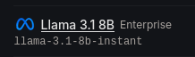

# subject-exercise

This project is a thin vertical slice for answering: "What should I practice next, and why?"

Given a student's practice history, the backend selects one skill using a deterministic heuristic.
It then asks Groq for a short, warm explanation, while retaining a deterministic fallback when the model is unavailable or returns unusable output.
The React client displays the recommendation in a single mobile-oriented screen.

## Requirements

Use Node.js 20.19 or newer.

## Run Locally

Install dependencies from the repository root:

```bash
npm install
```

Create the environment files:

```bash
cp apps/server/.env.example apps/server/.env
cp apps/web/.env.example apps/web/.env
```

Start the backend in one terminal:

```bash
npm run dev:server
```

The backend listens on `http://localhost:3000` by default.

Start the frontend in a second terminal:

```bash
npm run dev:web
```

The frontend listens on `http://localhost:5173` by default.

Open `http://localhost:5173` in a browser.

Set `GROQ_API_KEY` in `apps/server/.env` to get the Groq-generated explanation.

If no key is provided the deterministic fallback explanation takes the LLM's place.

## Environment Variables

Backend variables belong in `apps/server/.env`:

| Variable | Purpose | Default |
| --- | --- | --- |
| `PORT` | Backend listening port | `3000` |
| `WEB_ORIGIN` | Allowed browser origin for direct API requests | `http://localhost:5173` |
| `GROQ_API_KEY` | Key for the Groq-generated explanation; when unset, the fallback explanation is served | Empty |

Frontend variables belong in `apps/web/.env`:

| Variable | Purpose | Default |
| --- | --- | --- |
| `WEB_PORT` | Vite development server port | `5173` |
| `API_PROXY_TARGET` | Backend target for the Vite `/api` proxy | `http://localhost:3000` |
| `VITE_API_URL` | Optional direct API origin | Empty |


### Using Different Ports

For a backend on port `4000` and a frontend on port `8080`, configure:

`apps/server/.env`:

```env
PORT=4000
WEB_ORIGIN=http://localhost:8080
```

`apps/web/.env`:

```env
WEB_PORT=8080
API_PROXY_TARGET=http://localhost:4000
VITE_API_URL=
```

## API

### `GET /api/next-practice?student_id=<student-id>`

The endpoint returns the selected skill, a student-facing explanation, and the evidence used for the recommendation.

Example response for `student_id=stu_2277`, with the explanation omitted:

```json
{
  "skillId": "frac_add",
  "skillName": "Adding fractions with unlike denominators",
  "explanation": "...",
  "evidence": {
    "attempts": 5,
    "correct": 0,
    "hintUsed": 2,
    "medianSeconds": 69,
    "lastPracticed": "2026-08-13T17:26:00Z"
  }
}
```

## Dataset Loading

`apps/server/src/loadAttempts.ts` is the boundary between `attempts.json` and the rest of the application.

Conflicting duplicates are dropped and counted.

Identical duplicates collapse without increasing the dropped count.

The current export contains 69 raw attempt rows and 68 unique retained attempts.

Null time values are retained as attempts without a `secondsSpent` field.

The loader does not statistically clean or clip time values.

## Selection Logic

The pure function in `apps/server/src/recommendNextSkill.ts` selects the skill with the lowest Laplace-smoothed accuracy score:

```text
score = (correct + 1) / (attempts + 2)
```

It smoothly anchors low-evidence attempts without distorting the scores of highly tested skills. A skill with no attempts scores 50% and participates normally in ranking.

When scores are equal, ties are resolved in this order:

1. Oldest last-practice timestamp first: Based on the Ebbinghaus Forgetting Curve
2. More hint usage first: If accuracy and recency are identical, higher hint usage indicates less mastery.
3. Slower median response time first: I used the median instead of the mean to neutralize extreme outliers (e.g., a student stepping away from the device).
4. lphabetical skill_id order: Final deterministic fallback.

Hints, time, and recency do not affect the primary score.

The design rationale and worked examples are in `docs/recommendNextSkill.md`.

The loader design and validation decisions are in `docs/loadAttempts.md`.

Those documents describe the decisions and examples alongside the current implementation.

## LLM Reliability

The LLM only writes the explanation.

The configured model is Groq's `openai/gpt-oss-20b`.

The request has a five-second timeout.

The backend uses the deterministic fallback when:

- `GROQ_API_KEY` is missing.
- The provider returns a non-2xx response.
- The request fails, including timeout and network errors.
- The provider response has no usable message content.
- The explanation fails local validation.

The validator rejects explanations that are shorter than 20 characters, longer than 400 characters, or contain code fences, asterisks, or Markdown headings.

## Web Screen and 3G Constraints

The client is implemented in `apps/web/src/App.tsx`.

It requests the live `/api/next-practice`.

The screen includes loading, error, retry, and recommendation states.

It uses a system font stack and no images or webfont requests.

The production JavaScript bundle is approximately 60.9 KB gzipped in the current build.

The client makes one recommendation request when the selected student changes.

## Cost Estimate

The reason I pick `openai/gpt-oss-20b`. Generating a short, two-sentence student message is a low-effort task that doesn't require a heavy, expensive model. I initially evaluated `llama-3.1-8b-instant` for faster latency, but its usage is currently gated behind Enterprise access.



The configured Groq model is priced at approximately `$0.075 / 1M` input tokens and `$0.30 / 1M` output tokens at the time this README was written.

Assuming 300 input tokens and 100 billed output tokens per recommendation:

```text
(300 * $0.075 / 1,000,000) + (100 * $0.30 / 1,000,000)
= $0.0000225 + $0.00003
= $0.0000525 per recommendation
```

At 100,000 recommendations per day, that estimate is approximately `$5.25/day`, or `$157.50` for a 30-day month.

The first cost and reliability improvement would be caching the recommendation and explanation until the student's attempt data changes.

## Next Steps
Break ties between an unattempted skill and an attempted one in the unattempted skill's favor. As specified, a never-tried skill lands on exactly 50% score, and an attempted skill can land on that same score by coincidence. Treat "never practiced" as older than any actual practice date.

I would implement a wider variety of dynamic fallback messages. Growing the template pool and varying it.

I would iterate further on the LLM instructions to fine-tune the persona and ensure the output tone is perfectly calibrated for the target audience.

I would expand tests into a highly robust and complete testing suite.